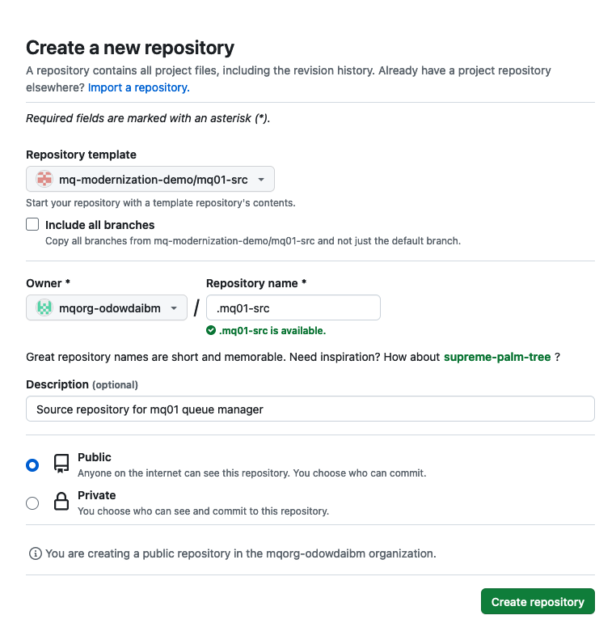
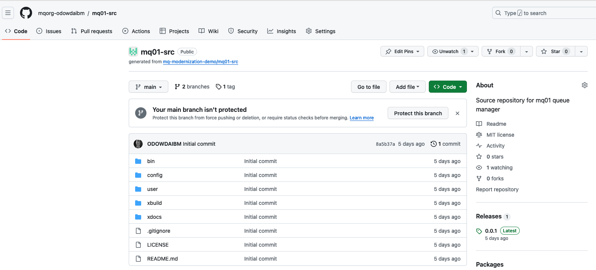
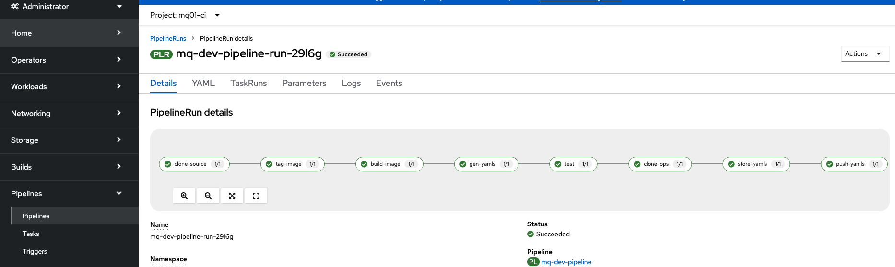
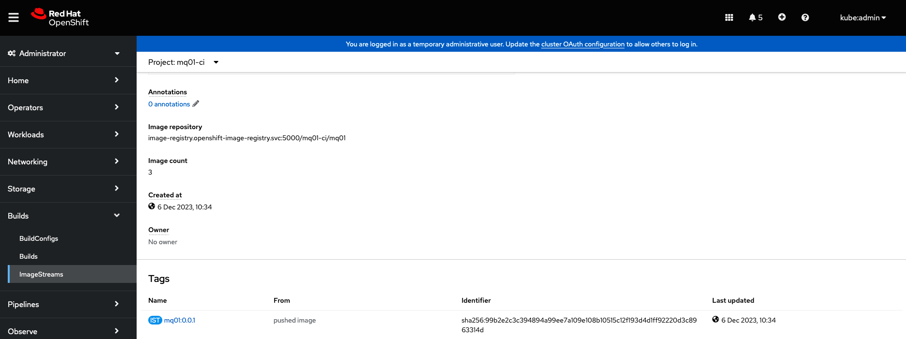
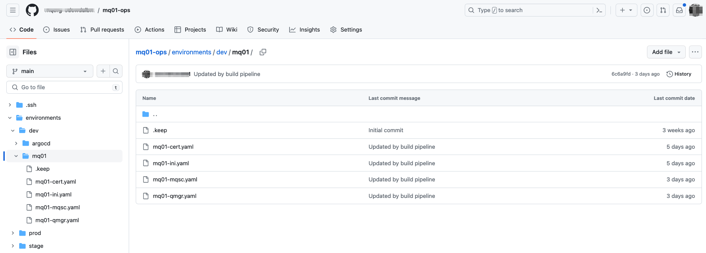
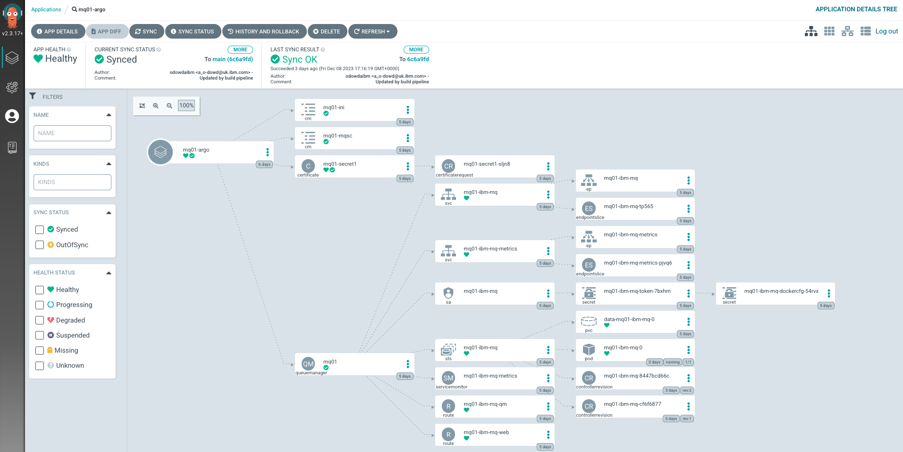
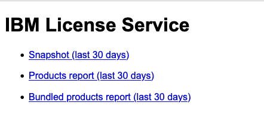

## Overview

This tutorial demonstrates a platform engineering approach to IBM MQ
development and deployment. It demonstrates continuous integration, continuous
deployment, GitOps, Infrastructure as Code and DevOps using containers,
Kubernetes and a set of popular cloud native tools such as ArgoCD and Tekton.

In this tutorial, you will:

1. Create a Kubernetes cluster and image registry, if required.
2. Create an operational repository to store MQ resources that are
   deployed to the Kubernetes cluster.
3. Install ArgoCD to manage the continuous deployment of MQ-related
   resources to the cluster.
4. Create a source Git repository that holds the MQ development artifacts
   for a queue manager.
5. Install Tekton to provide continuous integration of the source MQ
   artifacts. These pipeline ensures that all changes to these artifacts are
   successful built, packaged, versioned and tested before they are delivered
   into the operational repository, read for deployment.
6. Gain experience with the IBM-supplied MQ operator and container.

By the end of the tutorial, you will have practical experience and knowledge of
platform engineering with MQ in a Kubernetes environment.

---

## Introduction

The following diagram shows a CICD pipeline for MQ:


Notice:

- The git repository `mq01-src` holds the source development artifacts for a
  queue manager `mq01`.
- A Tekton pipeline uses the `mq01-src` repository to build, package, test,
  version and deliver resources that define the `mq01` MQ appliance.
- If the pipeline is successful, then the YAMLs that define `mq01` are stored in
  the operational repository `mq01-ops` and the container image for `mq01` is
  stored in an image registry.
- Shortly after the changes are committed to the git repository, an ArgoCD
  application detects the updated YAMLs. It applies them to the cluster to create or
  update a running `mq01` queue manager.


This tutorial will walk you through the process of setting up this configuration:
- Step 1: Follow [these instructions this
  repository](https://github.com/mq-modernization-demo/mq01-ops#readme) to set up your
  cluster, ArgoCD and the `mq01-ops` repository. When complete, you will return
  to this repository to complete step 2.
- Step 2: Continue with the instructions in this README to create the `mq01-src`
  repository, run a tekton pipeline to populate the `mq01-ops` repository and
  interact with the new or updated queue manager`mq01`.

---

## Restarting the tutorial

If you're doing this tutorial over an extended period, it may result in you
using a different terminal session. Don't forget to:

* Re-define key environment variables:

  ```bash
  export GITUSER=<GitHub user name>
  export GITORG=mqorg-$GITUSER
  export GITTOKEN=<PAT copied from GitHub>
  ```

* Login to Kubernetes cluster

  ```bash
  oc login --token=sha256~noTAVal1dSHA --server=https://example.cloud.com:31428
  ```

  by selecting `Copy login command` from the OpenShift web console.

---

## Creating the `mq01-src` repository

We use a [template
repository](https://github.com/mq-modernization-demo/mq01-src) to create a copy
of `mq01-src` in our organization. Using a template repository results in our
instance of `mq01-src` having a clean git history. It means that we can track
the history of changes to our queue manager `mq01`.

<br> Click on [this URL](https://github.com/mq-modernization-demo/mq01-src/generate) create
a fresh copy of `mq01-src`:



Substitute the relevant properties for your copy of `mq01-src`, specifically:

* In the `Owner` dropdown, select your recently created organization, e.g. `mqorg-xxxxx`
* In the `Repository name` field, specify `mq01-src`.
* In the `Description` field, specify `Source repository for mq01 queue manager`.
* Select `Public` for the repository visibility.

<br> Click on `Create repository`. The repository will be cloned to the specified GitHub account:



<br> You have successfully created a copy of the `mq01-src` repository in your
organization.

---

## Clone `mq01-src` to your local machine

We're going to use the contents of the `mq01-src` repository to build the `mq01`
queue manager. First we need to clone this repository to our local machine.

In the terminal window, issue the following command:

```bash
cd $HOME/git/$GITORG-tutorial
git clone https://$GITTOKEN@github.com/$GITORG/mq01-src.git
cd mq01-src
```

which will clone the repository to your local machine.

```bash
Cloning into 'mq01-src'...
remote: Enumerating objects: 69, done.
remote: Counting objects: 100% (69/69), done.
remote: Compressing objects: 100% (58/58), done.
remote: Total 69 (delta 4), reused 52 (delta 2), pack-reused 0
Receiving objects: 100% (69/69), 390.75 KiB | 1.01 MiB/s, done.
Resolving deltas: 100% (4/4), done.
```

You now have a local copy that you can work with on your local machine.

---

## The `mq01-src` repository

The structure of the `mq01-src` repository reflects the structure of the `mq01`
queue manager running in the cluster. When used in the continuous integration
(CI) pipeline, this contents of this repository define a container running the
`mq01` queue manager in a Kubernetes pod, together with all associated
Kubernetes artifacts, such as the secret that holds the queue manager's X.509
certificate. This is what it means to have **infrastructure as code**;
everything about `mq01` is in this git repository.

Let's explore the repository structure.

Issue the following command to see the top level folder structure.

```bash
tree -L 1
```

which shows a simple list of files and folders:

```bash
.
├── LICENSE
├── README.md
├── bin
├── config
├── user
├── xbuild
└── xdocs
```

The files are simple to understand:
* a `LICENSE` file
* a `README.md` containing this tutorial, with its associated documentation and
  diagrams in the `xdocs` folder

Let's now look at the structure of the three most important folders. Issue the
following command:

```bash
tree bin config user
```

which will show their hierarchical structure:

```bash
bin
└── Dockerfile
config
├── mqs.ini
├── qm.ini
├── scripts
│   ├── kustomization.yaml
│   ├── start-mqsc.sh
│   └── stop-mqsc.sh
└── yamls
    ├── kustomization.yaml
    ├── mq01-cert.yaml
    └── mq01-qmgr.yaml
user
└── mqsc
    └── mq01.mqsc
```

Note:
* The `bin` folder contains the exact version IBM MQ image being used by `mq01` via the `Dockerfile`
* The `config` folder contains the configuration of the queue manager for
  example, `qm.ini` and `mqs.ini` configuration files.
* The `user` folder contains the queue and channel definitions in support of MQ applications
  connected to this queue manager, in MQSC files.

Finally, the `xbuild` folder contains the continuous integration pipeline that
will build, test, version and store the `mq01` container and associated YAMLs.

Of course, other repository mappings are possible -- for example a repository
could define a queue manager cluster rather than a single queue manager.
However, the above structure is a great starting point for your learning and any
experimentation you might want to do in the future.

---

## MQ build pipeline

To build, test, version and create the image for the `mq01` queue manager, we're
going to use a set of Tekton tasks combined into a Tekton pipeline. Each task
will perform a specific function such as building the queue manager container
image, or testing it.

These artifacts are held in the `xbuild` folder; let's have a quick look at
them:

Issue the following command:

```bash
cd $HOME/git/$GITORG-tutorial/mq01-src/xbuild/pipelines/dev-build
tree -L 1
```

which will show the Tekton YAMLs:

```bash
.
├── extra-tutorials
├── mq-build-image.yaml
├── mq-clone.yaml
├── mq-dev-pipeline.yaml
├── mq-dev-pipelinerun.yaml
├── mq-gen-yamls.yaml
├── mq-push.yaml
├── mq-store-yamls.yaml
├── mq-tag.yaml
└── mq-test.yaml
```

You can examine these YAMLs to see how they work; here's a brief outline:

* `mq-dev-pipeline.yaml` defines a Tekton pipeline comprising the following tasks:
  * `mq-clone.yaml` defines a Tekton task to clone the `mq01-src` queue manager
    source repository.
  * `mq-tag.yaml` creates a version for this change based on the git tag, that
    can be used by other tasks.
  * `mq-build-image.yaml` builds a versioned image using the cloned repository
    and stores in the image registry.
  * `mq-gen-yamls.yaml` generates the Kubernetes YAMLs for the queue manager,
    including secrets and config maps.
  * `mq-test.yaml` tests the queue manager.
  * `mq-store-yamls.yaml` stores the YAMLs used to test the queue manager.
  * `mq-push.yaml` pushes the YAMLs to the `mq01-ops` repository, ready for
    deployment by ArgoCD.
* `mq-dev-pipelinerun.yaml` runs the pipeline to build the queue manager.
* the `extra-tutorials` folder contains YAMLs for follow-up topics including
  automatic CI and monitoring.

Let's now install and run the Tekton pipeline to build the queue manager `mq01`.

---

## Create cluster pipeline resources

Let's deploy these Tekton artifacts to the cluster so that we can use them to
build the `mq01` queue manager.

Issue the following command:

```bash
oc apply -f mq-clone.yaml
oc apply -f mq-gen-yamls.yaml
oc apply -f mq-push.yaml
oc apply -f mq-dev-pipeline.yaml
oc apply -f mq-store-yamls.yaml
oc apply -f mq-build-image.yaml
oc apply -f mq-test.yaml
oc apply -f mq-tag.yaml
```

which will generate responses similar to these:

```bash
task.tekton.dev/mq-git-clone configured
task.tekton.dev/mq-gen-yamls configured
task.tekton.dev/git-cli configured
pipeline.tekton.dev/mq-dev-pipeline configured
task.tekton.dev/mq-store-yamls configured
task.tekton.dev/buildah configured
task.tekton.dev/mq-test configured
task.tekton.dev/mq-tag configured
```

We now have a Tekton pipeline that we can use to build our queue manager, `mq01`.

---

## Customize pipeline

Before we can run this pipeline to build the queue manager, we need to
customize the **pipelinerun** YAML using our previously defined `$GITORG`
environment variable.

Let's inspect the `mq-dev-pipelinerun.yaml` YAML that runs the pipeline to build
the `mq01` queue manager.

```bash
cat mq-dev-pipelinerun.yaml
```
which will show its YAML:
(we've shown only the relevant YAML sections)

```yaml
apiVersion: tekton.dev/v1beta1
kind: PipelineRun
metadata:
  generateName: mq-dev-pipeline-run-
  namespace: mq01-ci
spec:
  serviceAccountName: pipeline
  pipelineRef:
    name: mq-dev-pipeline
...
  params:
  - name: source-repo-url
    value: https://github.com/$GITORG/mq01-src.git
  - name: dockerfile
    value: $(workspaces.source.path)/repo/main/bin/Dockerfile
  - name: ops-repo-url
    value: https://github.com/$GITORG/mq01-ops.git
  - name: image-reference
    value: image-registry.openshift-image-registry.svc:5000/mq01-ci/mq01
  - name: storage-driver
    value: vfs
  - name: tls-verify
    value: "false"
  - name: git-user-name
    value: "odowdaibm"
  - name: git-user-email
    value: "a_o-dowd@uk.ibm.com"
...
```

See how the `source-repo-url` pipeline parameter identifies the source
repository for `mq01`, and how `ops-repo-url` and `image-reference` identify
where the successfully tested YAMLs and container images are stored,
respectively.

Issue the following command to configure the `pipelinerun` with your `$GITORG`:

```bash
envsubst < mq-dev-pipelinerun.yaml > pipefile.tmp && mv pipefile.tmp mq-dev-pipelinerun.yaml
```

Verify that the `$GITORG` environment variable has been substituted by
re-examining the customized YAML:

```bash
  - name: source-repo-url
    value: https://github.com/mqorg-odowdaibm/mq01-src.git
```

In this example, we can see how the `mq01-src` repository in the
`mqorg-odowdaibm` will be used to build our version of the `mq01` queue manager.

---

## Run pipeline

Let's now run the pipeline. Each time we run the pipeline we get a new
**pipelinerun** resource in Kubernetes; that's why we using the `create` rather
than `apply` version of the command.

Issue the following command:

```bash
oc create -f mq-dev-pipelinerun.yaml
```

which will create a new **pipelinerun** in the cluster, for example:

```bash
pipelinerun.tekton.dev/mq-dev-pipeline-run-cmm7q created
```

Notice how each **pipelinerun** has a unique name generated by the addition of a
suffix, `cmm7q` in this case.

---

## Monitoring pipeline progress

You can watch the `pipelinerun` proceed in the web console.

Select `Pipelines->Pipelines` from the navigation pane and click on your
`pipelinerun` to see its progress.



Notice you can see the different **tasks** in the pipeline, such as
`clone-source` or `store-yamls`. You can select these tasks and see how they
proceed -- each task will write information messages to the console as they run,
allowing you to link back to the task script, if you need to understand how they
are coded for example.

---

## Monitoring progress in the Tekton command line

You can also use the `tkn` command line tool to view the logs from the terminal.

In the following command replace `xxxxx` with the new pipeline run identifier:

```bash
tkn pipelinerun logs mq-dev-pipeline-run-xxxxx -n mq01-ci -f
```

This will show the progress of the pipeline, for example:

```bash
Pipeline still running ...
PipelineRun is still running: Tasks Completed: 1 (Failed: 0, Cancelled 0), Incomplete: 7, Skipped: 0
```

---

## Exploring the pipelinerun results

When the pipeline run is finished, there will be new YAMLs in the `mq01-ops`
repository and a matching image in the image registry.

Select `Build->ImageStreams` from the navigation pane and click on the `mq01`
**imagestream** in the `m01-ci` namespace to see the container image that has
been built:



<br>

Note that every time an image is built, it will be tagged with a version string.
In the example, we can see image `mq01:0.0.1` has been built by the pipeline;
version `0.0.2` will be the next image built by it, and so on. We can also see
the time when the image was built.

This image will be referenced by the `mq01` **queuemanager** custom resource
that the **pipelinerun** has also built and stored in the `mq01-ops` repository.
Let's have a look at these resources in GitHub.

Issue the following command to determine the URL for your `mq01-ops` repository
where your CRs for `mq01` are held:

```bash
echo https://github.com/$GITORG/mq01-ops/tree/main/environments/dev/mq01
```

Paste the generated URL into your browser to see the structure of the `mq01-ops`
repository:



<br>

Notes:
* See how the URL refers to the `dev` environment.
* See how there are 4 YAMLs, each named according to the resource they define:
  * `mq01-qmgr.yaml` queue manager definition for `mq01`
  * `mq01-cert.yaml` X.509 digital certificate for `mq01`
  * `mq01-ini.yaml` mq.ini file for `mq01`
  * `mq01-mqsc.yaml` MQSC file for `mq01`

If you examine `mq01-qmgr.yaml` you will see how the `mq01` CR refers to the other CRs.

For example, the `mq01` YAML:

```yaml
mqsc:
  - configMap:
      name: mq01-mqsc
      items:
        - mq01.mqsc
ini:
  - configMap:
      name: mq01-ini
      items:
        - mq01.ini
```

shows how the `mq01` queue manager refers to the `mq01-mqsc` and `mq01-ini`
configmaps respectively.

Note also how the CR refers to the `mq01:0.0.1` image in the image registry:

```yaml
queueManager:
  debug: false
  image: image-registry.openshift-image-registry.svc:5000/mq01-ci/mq01:0.0.3
  imagePullPolicy: Always
```

Feel free to explore these YAMLs to see how the `mq01` queue manager and its
related resources are connected together. See how everything is anchored from
the `mq01-qmgr.yaml` YAML file.

---

## Exploring the deployed queue manager resources

We can now use ArgoCD to explore the `mq01` queue manager and associated
resources that have been deployed to the Kubernetes cluster.

Issue the following command to determine the URL you can use to view the
resources managed by the `mq01-argo` ArgoCD application:

```bash
echo $(oc get route openshift-gitops-server -n openshift-gitops -o jsonpath='{"https://"}{.spec.host}{"\n"}')"/applications/mq01-argo?resource="
```

Paste the generated URL into your browser to see the Kubernetes resources being managed by `mq01-argo`:



<br>

Notes:
* Notice how many resources are being managed by the `mq01-argo` application.
* Click on the `mq01-argo` application to see how it refers to URL
  `https://github.com/mqorg-odowdaibm/mq01-ops` and path
  `environments/dev/mq01/` to locate the YAMLs it will deploy to the cluster.
* See how `mq01-argo` directly manages the qmgr, certificate and two config
  maps, corresponding to the YAMLs in the `mq01-ops` folder.
* The `mq01` queue manager CR creates many other resources:
  * Application route to the queue manager.
  * UI route to the web console.
  * Pod that hosts the MQ container, built using the `mq01:0.0.1` image.
  * PVC (Persistent Volume Claim) that holds the queue manager queue
    configuration.
  * ServiceAccount under which the queue manager runs `mq01-ibm-mq`; recall how
    we granted it access to pull the image from the image registry in the first
    part of the tutorial.

Feel free to use ArgoCD to examine the deployed resources. You can equally view
the same resources using the `oc` CLI.

---

## Interact with Queue manager

We can connect to the queue manager using the MQ web console. The MQ operator
has created two routes for the queue manager:

* a route for applications and channels to connect to the queue manager
* a route for users to connect to the web console

Issue the following command to get the route for the MQ web console:

```bash
oc get route mq01-ibm-mq-web -n mq01-dev -o jsonpath='{"https://"}{.spec.host}{"\n"}'
```

which shows the route, for example:

```bash
https://mq01-ibm-mq-web-mq01-dev.apps.ajoclus02.snoajo2.com
```

You can connect to the web console using your browser. You may need to add
(e.g.) `mq01-ibm-mq-web-mq01-dev.apps.ajoclus02.snoajo2.com` to your
`/etc/hosts` file of your local machine.

Login to the console using:
* `username:` `admin`
* `password:` `passw0rd`

Feel free to explore the web console.

---

## Connect to IBM Licensing instance

You can run an IBM Licensing report to show the deployed queue manager. When the
IBM Licensing instance was created, it created a route to its web interface.
Let's determine the address of the web interface and then use it to generate a
report.

```bash
oc get route ibm-licensing-service-instance1 -n ibm-common-services
```

which will show the hostname for the licensing service web interface.

```bash
NAME                              HOST/PORT                                                                        PATH   SERVICES                          PORT       TERMINATION        WILDCARD
ibm-licensing-service-instance1   ibm-licensing-service-instance1-ibm-common-services.apps.sno-ajo-1.snoajo1.com          ibm-licensing-service-instance1   api-port   passthrough/None   None

```

Use the host name in your browser to connect to the Licensing instance:



Notice how different reports are available to you.

---

## Generate a License report

Let's generate a snapshot report that shows the IBM products currently running.
You will need an authentication token to generate a report.

Issue the following command:

```bash
oc get secret ibm-licensing-token -o jsonpath={.data.token} -n ibm-common-services | base64 -d; printf "\n"
```

to determine the authentication token, such as:

```bash
lWoOyrmrats4x0o5dTx6NXAe
```

* Click on `Snaphot` and paste the `Authentication token` determined above.

Download the ZIP file, and examine the the available reports.

For example the `products_daily_*` file might contain the following entry for our queue managers, indicating the usage over 2 successive days.

```bash
date	    name	        id	                                metricName          	metricQuantity	clusterId
21/08/2023	IBM MQ Advanced	208423bb063c43288328b1d788745b0c	PROCESSOR_VALUE_UNIT	70	            sno.sno-ajo-1.snoajo1.com
22/08/2023	IBM MQ Advanced	208423bb063c43288328b1d788745b0c	PROCESSOR_VALUE_UNIT	70           	sno.sno-ajo-1.snoajo1.com
```

---

## Congratulations

Well done! You have successfully completed this tutorial. You have

* Configured a Kubernetes cluster for Platform Engineering including CICD and
  GitOps.
* Built and deployed a queue manager, deployed it, and interacted with it.

---

## Extending the tutorial

Now that you have a working MQ deployment running in Kubernetes, you add to it in multiple ways:

* [Continuous integration with Tekton triggers](./xdocs/extra/tutorial2.md)

* [Monitoring with Prometheus and Grafana](./xdocs/extra/tutorial3.md) (**TBD**)


