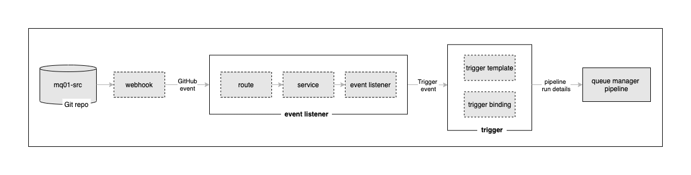

# Adding continuous integration

In this tutorial extension, we're going to make the Tekton pipeline part of a
continuous integration process whereby any change to the `mq01-src` repository
will **automatically** result in a an updated `mq01` queue manager being built
and deployed to the cluster. It will still reference the same queue files and
log files -- no messages will be lost.

## Tekton event listeners and triggers

In the following diagram, you can see how we'd like to configure our deployment so that every time the `mq01-src` repository changes, the pipeline to
build the correspondingly updated `mq01` will be run. In this part of the tutorial, we're going to set up
the event listener and trigger Tekton resources to do this.




A GitHub event containing information about the `mq01-src` change is generated
by our webhook and sent to an **event listener**. In Kubernetes, this event
listener comprises a normal `route` and `service` front-ending a Tekton
`eventlistener` custom resource. The event listener is driven by the webhook,
and runs the pipeline using a Tekton **trigger**.  A trigger has two components,
a `triggertemplate` that specifies the pipeline to run, and a `triggerbinding`
that allows the trigger event data to be presented to the pipeline run in the
order it expects.

---

## Creating the webhook

A webhook provides a loosely coupled connection between GitHub and the pipeline
that builds the source repository. Its design is a little more complex than
directly linking GitHub to our pipeline, but as we'll see, this design is much
more flexible. This [short
article](https://cloud.redhat.com/blog/guide-to-openshift-pipelines-part-6-triggering-pipeline-execution-from-github)
provides a nice overview on how to use webhooks with OpenShift.

Issue the following command to view the template of the event listener YAML:

```bash
cat setup/mq-event-trigger.yaml
```

``` yaml
apiVersion: triggers.tekton.dev/v1alpha1
kind: EventListener
metadata:
  labels:
    app: mq-event-listener
  name: mq-event-listener
spec:
  serviceAccountName: pipeline
  triggers:
  - name: mq01-dev
    interceptors:
      - ref:
          name: "cel"
        params:
        - name: "filter"
          value: "header.match('X-GitHub-Event', 'push') && body.ref == 'refs/heads/main' && body.repository.full_name == '$GITORG/mq-qm01'"
    bindings:
      - ref: mq-trigger-binding
    template:
      ref: mq01-dev
```

You can read more about event listeners, triggers and interceptors
[here](https://tekton.dev/docs/triggers/).

Explore and customize the event listener:

```bash
envsubst < mq-event-listener.yaml > eventfile.tmp && mv eventfile.tmp mq-event-listener.yaml
``````
```bash
oc apply -f mq-event-route.yaml
oc apply -f mq-event-listener.yaml
oc apply -f mq-trigger-template.yaml
oc apply -f mq-trigger-binding.yaml
```

```bash
oc get route -n ci
```

To view the event listener service that is accessed via the route, issue the
following command:

```bash
oc get eventlistener -n ci
```

To view the trigger template that is used by the event service to call the
`mq-qm-dev` pipeline, issue the following command:

```bash
oc get triggertemplate -n ci
```

To view the trigger binding that is used to marshal the input for the
pipeline run, issue the following command:

```bash
oc get triggerbinding -n ci
```

```bash
echo https://github.com/${GITORG}/mq01-src/settings/hooks/new
```


```bash
echo http://$(oc get route mq-event-listener -n mq01-ci -o jsonpath='{.spec.host}')
```


1.  *Exploring the* `cntk-event-listener` *Kubernetes resource*

      Let's spend a few moments exploring the event listener resources.

      If you observe the above picture carefully, below are few things to note:

      * See how the `eventlistener` custom resource deployed by the ArgoCD
        application has created a service named `el-cntk-event-listener`. The
        event listener route points to this service.
      * The event listener runs in a pod, managed by a replicaset, defined by a
        deployment. It's this pod that will handle the webhook request, and call
        the trigger if the interceptor `filter` evaluates to `true`.

2.  *Exploring the resources using the* `oc` *command*

      We can use also use the `oc` command to explore our webhook resources:

      To view the route that is called by the webhook, issue the following command:

      ```bash
      oc get route -n ci
      ```

      To view the event listener service that is accessed via the route, issue the
      following command:

      ```bash
      oc get eventlistener -n ci
      ```

      To view the trigger template that is used by the event service to call the
      `mq-qm-dev` pipeline, issue the following command:

      ```bash
      oc get triggertemplate -n ci
      ```

      To view the trigger binding that is used to marshal the input for the
      pipeline run, issue the following command:

      ```bash
      oc get triggerbinding -n ci
      ```

      You can explore these resources in more detail by adding the `-o yaml` option.

      For now, it's enough to understand understand that `webhook`->`route`->`event
      listener`->`trigger template`->`pipeline`.

      Let's now configure a GitHub webhook to use these components.

3.  *The GitHub webhook UI*

      Let's now use the GitHub UI, to configure a webhook that creates an event and sends it to the route
      whenever the queue manager source repository changes.

      We'll configure the webhook using the GitHub UI.

      Issue the following command to determine the URL for the UI:

      ```bash
      echo https://github.com/${GIT_ORG}/mq-qm01/settings/hooks/new
      ```

      for example:

      ``` { .text .no-copy }
      https://github.com/prod-ref-guide/mq-qm01/settings/hooks/new
      ```

      Copy the URL into your browser to launch the GitHub webpage to configure a new
      webhook for your `mq-qm01` repository:

      

      We need to complete these details to configure our webhook.

4.  *Configure the webhook*

      To configure a webhook, we need to identify the URL it will call when it
      generates an event, the format of the event, and for which GitHub events we'll
      generate an event.

      Issue the following command to determine the URL of the event listener route:

      ```bash
      echo http://$(oc get route el-cnkt-event-listener -n ci -o jsonpath='{.spec.host}')
      ```

      for example:

      ``` { .text .no-copy }
      http://el-cnkt-event-listener-ci.xxxxx.containers.appdomain.cloud
      ```

      Here's a sample webhook configuration:

      

      Configure the following arguments:

      * Set the **Payload URL** using the event listener route address.
      * Set **Content type** to `application/json`.
      * Select **Let me select individual event**
        * Select **Pull requests** and **Pushes** from the list of available
          events.

      

      Click on `Add webhook` to create the webhook.

5.  *A new webhook has been added*

      In the GitHub UI, you can see that a new webhook has been added:

      

      Notice the webhook's name and that it's generating and event whenever a
      `pull-request` or `push` is issued against this repository.

      Let's now make a change to the `QM1` source repository and watch the webhook
      at work.

---

## Making a change to the queue manager `QM1`

Now that we've configured our webhook, together with the Kubernetes resources to
process an event generated by it, let's put it to work.

In this section, we'll add a new queue to `QM1`using GitOps. To do this, we'll
update the `QM1` source repository -- adding a the new queue definition to the
queue manager MQSC configuration -- and push this change to GitHub. This will
trigger a new pipeline run that will build and test our change. If successful,
new versions of the queue manager image version and Helm chart will be produced.
The GitOps Helm chart will be automatically deployed to the cluster by our
ArgoCD application, resulting in an updated deployment for `QM1` that contains
the new queue definition.

5. *Update* `queuemanager.yaml` *file*

      Let's quickly review the current `queuemanager.yaml` file, before we add our new resource limit definitions.

      Issue the following command:

      ```bash
      cat kustomize/base/generic-qmgr/queuemanager.yaml
      ```

      to view the resource limit definitions:

      ```{ .text .no-copy }
      resources:
        limits:
          cpu: "1"
          memory: 1Gi
        requests:
          cpu: "1"
          memory: 1Gi
      ```

      Using your favorite editor, update memory to `2Gi`:

      ```text hl_lines="4"
      resources:
        limits:
          cpu: "1"
          memory: 2Gi
        requests:
          cpu: "1"
          memory: 1Gi
      ```

      Notice how we've modified the `memory` of the queuemanager from `1Gi` to `2Gi`.

7. *GitHub event generated*

      This push to GitHub should generate a GitHub webhook event for the `mq-qm01`
      repository.  We can look at the most recent webhook events.

      Click on the newly created webhook `http://el-cnkt-event-listener...` and
      select the **Recent Deliveries** tab.

      This is one of our sample Deliveries:

      

      Notice:

      * The date and time when the webhook event was generated in the format
        `yyyy-mm-dd hh:mm:ss`
      * The **Request URL** header identifies the event.
        listener `http:://el-cnkt-event-listener...`
      * **"ref": "refs/heads/qm1-GitOps-MQ-23052022"** identifies the branch that
        was pushed.
      * **"repository.full_name": "GitOps-MQ-23052022/mq-qm01"** identifies the
        repository that was changed.

      The **Recent Deliveries** tab can be very helpful to diagnose any issues you
      might have webhook event generation.

      Let's now see how this webhook event is handled by the event listener in the
      cluster.

8. *Event handled in the cluster*

      Let's have a look at how the GitHub event is processed by the event listener
      in the cluster. We can look at the event listener logs to see how the event is
      received and processed using the `oc logs` command.

      Issue the following command:

      ```bash
      oc logs deploy/el-cnkt-event-listener -n ci
      ```

      to show the log messages issued by the `el-cnkt-event-listener`:

      ``` { .json .no-copy }
      {"level":"info","ts":"2022-05-30T08:53:23.172Z","logger":"eventlistener","caller":"resources/create.go:98","msg":"Generating resource: kind: &APIResource{Name:pipelineruns,Namespaced:true,Kind:PipelineRun,Verbs:[delete deletecollection get list patch create update watch],ShortNames:[pr prs],SingularName:pipelinerun,Categories:[tekton tekton-pipelines],Group:tekton.dev,Version:v1beta1,StorageVersionHash:RcAKAgPYYoo=,}, name: mq-qm-dev-","commit":"fbb0fd1","knative.dev/controller":"eventlistener"}
      {"level":"info","ts":"2022-05-30T08:53:23.172Z","logger":"eventlistener","caller":"resources/create.go:106","msg":"For event ID \"c2f8ccb5-e102-4dd2-b147-f60b0f63516c\" creating resource tekton.dev/v1beta1, Resource=pipelineruns","commit":"fbb0fd1","knative.dev/controller":"eventlistener"}
      ```

      (You can scroll right in the above output.)

      Notice:

      * Multiple log entries have been issued for the same input event. Notice
        how the timestamps `"ts":` are the same.
      * The first entry identifies the data generated by the trigger template
        that will be passed to the pipeline:
        * See how `gitrevision` value matches that in the webhook `"after"`
          value.
        * See how `gitrepositoryurl` value matches your fork of the `mq-qm01`
          repository.
      * The second entry informs us that a new `PipelineRun` has been created for
        the pipeline `mq-qm-dev`.
      * The third entry shows us the `event ID` that the event listener is using
        for the processing of this webhook event.

      The order of these events isn't really important; what's clear is that the
      pipeline run has been launched based on the webhook notification processes by
      the event listener.

      The `oc logs` command can be very helpful to diagnose any issues you might
      have with the event listener.

9. *The new pipeline run starts*

      We can now see that our pipeline run has started.

      In the OpenShift web console, navigate to `Pipelines->Pipelines`.  Select the
      `mq-qm-dev` pipeline and `Project: ci`:

      

      We can see a new pipeline run for `mq-qm-dev` is in progress.

      Notice the **Labels** for this pipeline run:

      * See how the tekton event listener `cnkt-event-listener` is identified.
      * See how the `trigger-eventid` allows us to link this pipeline run back to
        a Tekton event for traceability.
